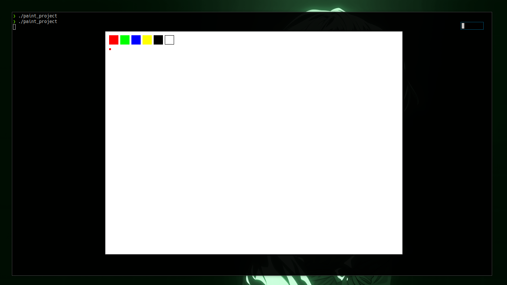

---



```md
# Paint

This is a minimal SDL-based paint tool.  
You can draw using your mouse and change colors with the keyboard.

## Controls

- 🖱️ Mouse Left Button — draw
- 1–5 — switch colors
- C — clear canvas
- Esc — quit

