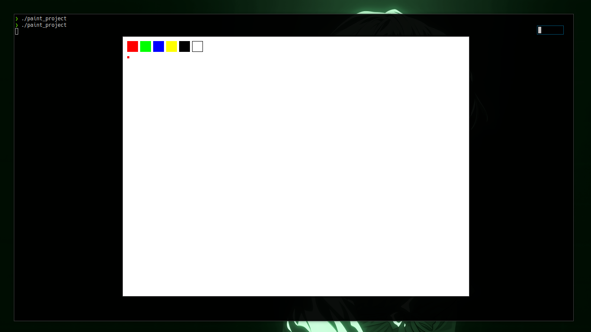

# Paint

A small paint tool built in C using SDL2.  
Created while learning how graphics rendering and event handling work.

## Overview

This project was made to explore the basics of drawing with SDL — how to handle input, render shapes, and manage colors on a persistent canvas.

You can draw on the screen with your mouse, switch between colors using the keyboard, and clear the canvas when needed.



## How It Works

- Initializes SDL and creates a window with a renderer.
- Listens for mouse and keyboard events.
- Draws colored rectangles (brush strokes) on the canvas in real time.
- Maintains a persistent canvas so drawings stay visible between frames.

## Controls

- Mouse Left Button — draw  
- 1–5 — change colors  
- C — clear the canvas  
- Esc — quit

## Build and Run

Make sure SDL2 is installed.

```bash
sudo apt install libsdl2-dev
```

2. Build:

```bash
cd paint
make
```

3. Run:

```bash
./paint
```


